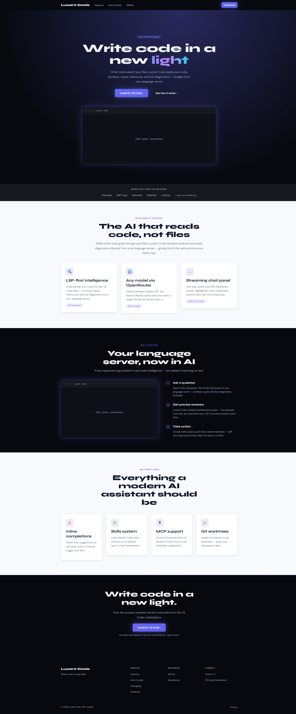
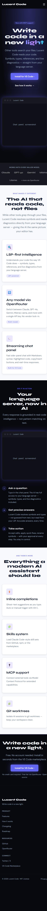

# Regression Report — Lucent Code Marketing Site

**Date:** 2026-03-20 18:22
**Application URL:** http://localhost:5173
**Branch:** master

---

## Summary

| Metric | Value |
|---|---|
| Date | 2026-03-20 18:22 |
| Application URL | http://localhost:5173 |
| Pages Tested | 1 (single-page app) |
| Viewports Tested | 3 (Desktop, Tablet, Mobile) |
| Existing Tests Passed | 32 |
| Existing Tests Failed | 0 |
| Console Errors Found | 1 |
| Network Errors Found | 0 |
| Visual Issues Found | 3 |
| **Overall Status** | **PASS** |

---

## Phase 2: Existing Test Results

**Framework:** Vitest 2.1.9
**Command:** `npm test -- --reporter=verbose`

| Result | Count |
|---|---|
| Passed | 32 |
| Failed | 0 |
| Skipped | 0 |

All 8 test files passing:

- `src/styles/tokens.test.ts` — 2 tests
- `src/sections/SocialProofStrip.test.tsx` — 2 tests
- `src/components/FeatureCard.test.tsx` — 3 tests
- `src/sections/DemoSection.test.tsx` — 3 tests
- `src/components/primitives.test.tsx` — 8 tests
- `src/sections/HeroSection.test.tsx` — 5 tests
- `src/components/NavBar.test.tsx` — 5 tests
- `src/sections/remaining.test.tsx` — 4 tests

---

## Phase 3: Browser-Based Testing

### Functional Check Results

**Page:** `/` (single-page marketing site)

| Check | Result | Notes |
|---|---|---|
| Page title | ✅ Pass | "Lucent Code — Write code in a new light." |
| Skip link present | ✅ Pass | `<a href="#main-content">Skip to content</a>` |
| Landmark roles | ✅ Pass | `banner`, `main`, `contentinfo`, `navigation` all present |
| `<h1>` present | ✅ Pass | "Write code in a new light" |
| Heading hierarchy | ✅ Pass | h1 → h2 (×4) → h3 (×10) |
| NavBar links | ✅ Pass | Features, How it works, GitHub, Install free |
| CTA buttons | ✅ Pass | Primary + secondary visible and linked |
| Social proof strip | ✅ Pass | 5 model names + "more via OpenRouter" |
| Core features grid | ✅ Pass | 3 cards: LSP-first, OpenRouter, Streaming chat |
| Demo steps | ✅ Pass | 3 steps numbered 1–3 |
| Advanced features grid | ✅ Pass | 4 cards: Inline completions, Skills, MCP, Worktrees |
| CTA banner | ✅ Pass | Heading + Install CTA + trust line |
| Footer navigation | ✅ Pass | 3 nav sections (Product, Resources, Connect) |
| Footer copyright | ✅ Pass | "© 2026 Lucent Code · MIT License" |
| Console errors | ⚠️ 1 error | favicon.ico 404 (see Issues) |
| Network errors | ✅ Pass | No failed API or resource requests |

---

### Visual Evaluation

#### Desktop (1920×1080)

| Criterion | Status | Notes |
|---|---|---|
| Layout | ✅ Pass | All sections aligned correctly, container max-width respected |
| Spacing | ✅ Pass | Section padding generous and consistent throughout |
| Typography | ✅ Pass | Syne display font bold and impactful; DM Sans body readable |
| Color | ✅ Pass | Indigo/violet/cyan gradient on hero "light" word renders correctly |
| Responsiveness | ✅ Pass | Desktop layout fills appropriately, no overflow |
| Dark/light rhythm | ✅ Pass | Dark hero → light features → dark demo → light advanced → dark CTA → dark footer |
| Core Features | ✅ Pass | 3-column grid as contracted |
| Advanced Features | ✅ Pass | 4-column grid as contracted |
| Demo section | ✅ Pass | 2-column layout: screenshot left, steps right |
| NavBar | ✅ Pass | Transparent over hero; all links visible |
| CTA buttons | ✅ Pass | Primary button with glow effect; secondary ghost button |
| Polish | ✅ Pass | Glow effects, badge, gradient text — professional finish |

**Notes:** Code showcase is a placeholder ("Chat panel screenshot") — expected per open questions in UI contract.

---

#### Tablet (768×1024)

| Criterion | Status | Notes |
|---|---|---|
| Layout | ✅ Pass | Single-column hero, hamburger menu visible |
| Typography | ✅ Pass | Display font scales well, body text readable |
| Color | ✅ Pass | Gradient text on hero correctly rendered |
| NavBar | ✅ Pass | Logo + hamburger (≡), desktop links hidden |
| CTA buttons | ✅ Pass | Stack vertically, full-width, well-spaced |
| Core Features grid | ⚠️ Minor | Shows 1-col (mobile) layout at exactly 768px — see Issues #1 |
| Advanced Features grid | ⚠️ Minor | Shows 1-col (mobile) layout at exactly 768px — see Issues #1 |
| Demo section | ✅ Pass | Stacked layout, screenshot full-width |
| Footer | ✅ Pass | Columns adapt properly |
| Polish | ✅ Pass | No overflow, alignment consistent |

---

#### Mobile (375×812)

| Criterion | Status | Notes |
|---|---|---|
| Layout | ✅ Pass | Single-column throughout, no horizontal overflow |
| Typography | ✅ Pass | Large display heading wraps naturally across 3 lines |
| Color | ✅ Pass | Gradient on "light" renders correctly at mobile size |
| NavBar | ✅ Pass | Hamburger (≡) with accessible 44×44px touch target |
| CTA buttons | ✅ Pass | Full-width, well-spaced, 52px tall (good touch target) |
| Feature cards | ✅ Pass | Single column, readable |
| Demo section | ✅ Pass | Stacked layout works well |
| Footer | ✅ Pass | Link sections stack vertically, all readable |
| Polish | ✅ Pass | Clean, no artifacts |

---

## Issues (Prioritized)

### Minor

**Issue 1: Feature grids show 1-column at exactly 768px viewport**
- **Severity:** Minor
- **Viewport:** Tablet (768px)
- **Description:** The CSS breakpoint `@media (max-width: 768px)` collapses feature grids to 1 column. At exactly 768px viewport width (common tablet emulation), the mobile layout is shown instead of the 2-column tablet layout. The contract specifies 2 columns at 768–1279px.
- **Fix:** Change `@media (max-width: 768px)` to `@media (max-width: 767px)` in [CoreFeaturesGrid.css](../marketing/src/sections/CoreFeaturesGrid.css) so 768px triggers the tablet layout, not the mobile one.

**Issue 2: Missing favicon.ico**
- **Severity:** Minor
- **Description:** Browser requests `favicon.ico` and receives 404. No favicon is defined in `index.html`.
- **Fix:** Add a `<link rel="icon">` in [index.html](../marketing/index.html), or add a `public/favicon.ico` file.

**Issue 3: Code showcase is a placeholder**
- **Severity:** Minor (known, expected)
- **Description:** Both HeroSection and DemoSection display "Chat panel screenshot" placeholder text instead of a real screenshot. This was noted as an open question in the UI contract.
- **Fix:** Replace placeholder with a real PNG screenshot of the Lucent Code chat panel before launch.

---

## Recommendations

1. **Fix the 768px breakpoint boundary (Issue 1)** — 1-line CSS change; ensures tablets get the 2-column grid layout as designed.
2. **Add favicon** — Eliminates the console 404 error and improves tab/bookmark presentation.
3. **Replace code showcase placeholders** — The mock panels are styled well and hold the layout, but a real screenshot before launch would significantly improve trust and conversion.

---

## Screenshots Index

| File | Viewport |
|---|---|
| `home-desktop.png` | 1920×1080 viewport |
| `home-desktop-full.png` | 1920×1080 full page |
| `home-tablet.png` | 768×1024 viewport |
| `home-tablet-full.png` | 768×1024 full page |
| `home-mobile.png` | 375×812 viewport |
| `home-mobile-full.png` | 375×812 full page |
