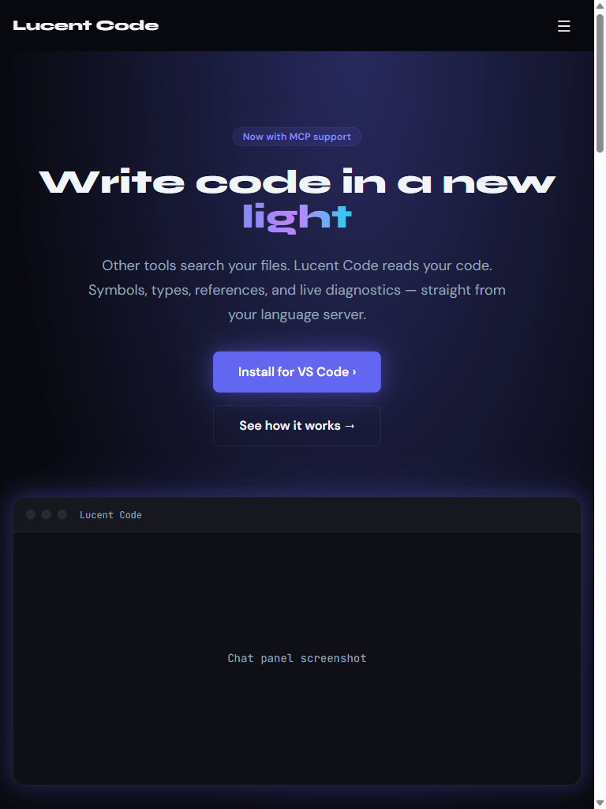
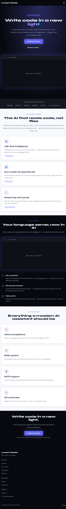
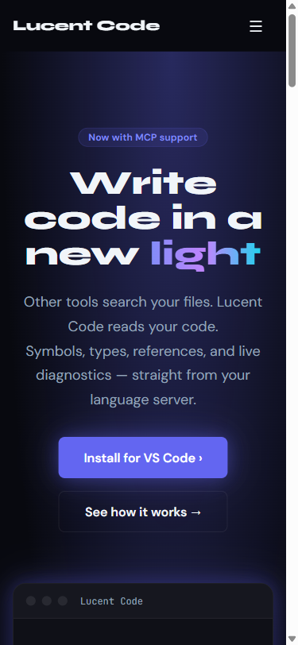

# Regression Report — Lucent Code Marketing Site

**Date:** 2026-03-20 19:44
**Application URL:** http://localhost:5173
**Branch:** master (post webview-branding commits)

---

## Summary

| Metric | Value |
|---|---|
| Date | 2026-03-20 19:44 |
| Application URL | http://localhost:5173 |
| Pages Tested | 1 (single-page app) |
| Viewports Tested | 3 (Desktop, Tablet, Mobile) |
| Existing Tests Passed | 32 |
| Existing Tests Failed | 0 |
| Console Errors Found | 1 |
| Network Errors Found | 0 |
| Visual Issues Found | 0 |
| **Overall Status** | **PASS** |

---

## Phase 2: Existing Test Results

**Framework:** Vitest 2.1.9 | **Command:** `npm test -- --run --reporter=verbose`

32/32 passed, 0 failed. No regressions from the webview branding commits (marketing site files were not touched).

---

## Phase 3: Browser-Based Testing

### Functional Check

| Check | Result |
|---|---|
| Page title | ✅ "Lucent Code — Write code in a new light." |
| All 8 sections present | ✅ |
| Nav links | ✅ Features, How it works, GitHub, Install free |
| Console errors | ⚠️ favicon.ico 404 (pre-existing, unchanged) |
| Network errors | ✅ None |

---

### Visual Evaluation

#### Desktop (1920×1080)

✅ No regressions. All sections render identically to the previous run. Hero gradient text, feature grids, demo section, CTA banner, and footer all intact.

#### Tablet (768×1024)

✅ No regressions. Pre-existing 768px boundary behaviour (1-col grid) unchanged — noted in previous report as Minor.

#### Mobile (375×812)

✅ No regressions. Single-column layout, responsive typography, all sections clean.

---

## Verdict

**PASS — no regressions introduced by the webview branding commits.** The marketing site is unaffected. Only pre-existing minor issues carry forward (favicon 404, 768px grid boundary).
