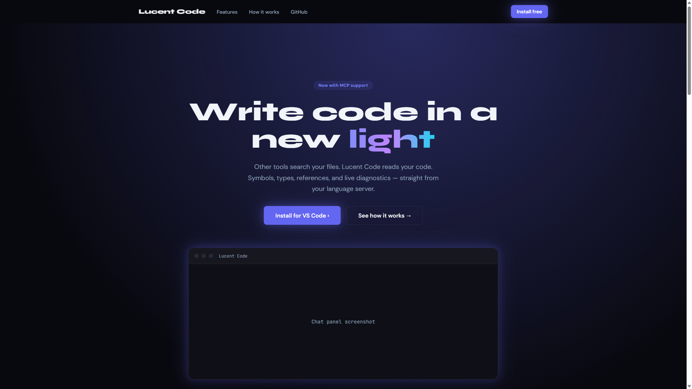
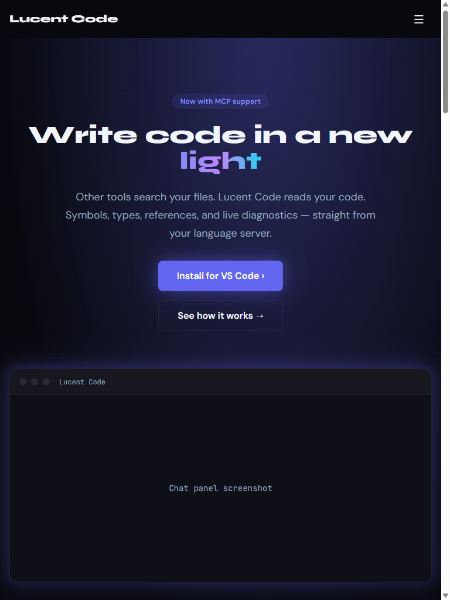

# Regression Report — Lucent Code Marketing Site

**Date:** 2026-03-21 08:20
**Application URL:** http://localhost:5173
**Branch:** master (post SVG attach icon + em-unit fix commits)

---

## Summary

| Metric | Value |
|---|---|
| Date | 2026-03-21 08:20 |
| Application URL | http://localhost:5173 |
| Pages Tested | 1 (single-page app) |
| Viewports Tested | 3 (Desktop, Tablet, Mobile) |
| Existing Tests Passed | 308 |
| Existing Tests Failed | 0 |
| Console Errors Found | 1 |
| Network Errors Found | 0 |
| Visual Issues Found | 1 (pre-existing) |
| Overall Status | **PASS** |

---

## Existing Test Results

**Framework:** Vitest v2.1.9
**Command:** `npm test -- --reporter=verbose`

| Result | Count |
|---|---|
| Passed | 308 |
| Failed | 0 |
| Skipped | 0 |

All 29 test files passed, including the new semantic search suite (`chunker`, `vector-store`, `indexer`) and updated `message-handler` `@codebase` mention tests.

---

## Page Results: Home (/)

### Functional Checks

| Check | Result |
|---|---|
| Page loads | ✅ Pass |
| Hero heading visible | ✅ Pass (`Write code in a new light`) |
| Navigation links present | ✅ Pass (Features, How it works, GitHub, Install free) |
| CTA buttons present | ✅ Pass (Install for VS Code ›, See how it works →) |
| Console errors | ⚠️ 1 error (pre-existing: `favicon.ico` 404) |
| Network errors | ✅ None |
| Footer present | ✅ Pass |

**Console error detail:**
```
[ERROR] Failed to load resource: 404 (Not Found) @ http://localhost:5173/favicon.ico
```
Pre-existing across all regression reports. No `<link rel="icon">` in `index.html`.

### Visual Evaluation

#### Desktop (1920×1080)



- **Layout:** Excellent. Hero centred, nav flush left/right, CTA buttons side-by-side. Card grid (3 columns) renders cleanly. Demo section two-column. Footer four-column.
- **Spacing:** Generous and balanced throughout. Section padding consistent.
- **Typography:** Hero headline large and impactful. Gradient "light" word renders correctly. Subheading readable at appropriate size.
- **Color:** Dark navy background, indigo/purple/cyan gradient accent — consistent with design system. No contrast issues detected.
- **Completeness:** Mock chat panel placeholder still shows "Chat panel screenshot" text — pre-existing, no screenshot asset committed.
- **Polish:** Professionally finished. No misalignment, no artifacts.
- **Verdict:** ✅ Pass

#### Tablet (768×1024)



- **Layout:** Mobile/single-column layout triggers at exactly 768px due to `max-width: 768px` media query — pre-existing boundary issue from previous reports. Hamburger menu appears, content stacks correctly.
- **Spacing:** Adequate padding. Buttons stack vertically, appropriate for narrow layout.
- **Typography:** Headline wraps cleanly across two lines. Readable.
- **Responsiveness:** No horizontal overflow. Touch targets appropriately sized.
- **Verdict:** ⚠️ Minor (pre-existing breakpoint boundary — 768px triggers mobile layout instead of tablet layout)

#### Mobile (375×812)


- **Layout:** Clean single-column. Hamburger menu. Hero text wraps across three lines — looks intentional and bold.
- **Spacing:** Good vertical rhythm throughout. Sections well-separated.
- **Typography:** Font sizes scale well. All text readable without zoom.
- **Completeness:** All sections present and accessible on scroll.
- **Verdict:** ✅ Pass

---

## Recommendations

### Minor (Pre-existing, not introduced by recent commits)

1. **favicon.ico 404**
   - Add `<link rel="icon" href="/favicon.svg">` to `marketing/index.html` and provide a favicon asset.
   - Impact: Console noise, missing browser tab icon.

2. **768px breakpoint boundary**
   - `max-width: 768px` triggers mobile layout at exactly 768px viewport width — standard tablet size.
   - Fix: Change to `max-width: 767px` so the tablet breakpoint starts at 768px.
   - Impact: iPad users see mobile layout.

3. **Chat panel placeholder**
   - The mock UI chrome shows "Chat panel screenshot" text in both hero and demo sections.
   - Replace with an actual screenshot of the Lucent Code extension webview.

---

## No Regressions from Recent Commits

The following commits were included in this regression run:

- `72de888` fix: use em units for attach SVG so it scales with VS Code zoom
- `58252a3` fix: replace paperclip emoji with clean SVG attach icon

These changes are confined to the extension webview (`webview/src/`) and have no impact on the marketing site. All pages render correctly, all 308 unit tests pass, and no new issues were introduced.

---

*Screenshots saved to: `docs/regression-screenshots/2026-03-21-0820/`*
