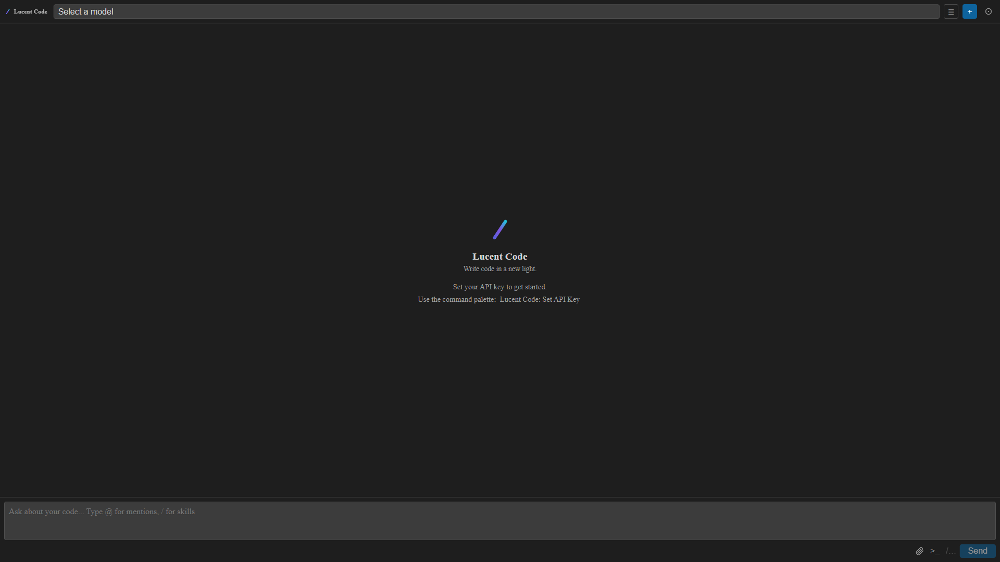
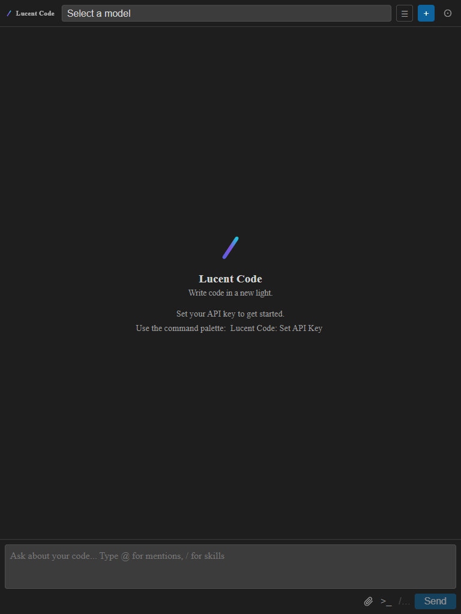
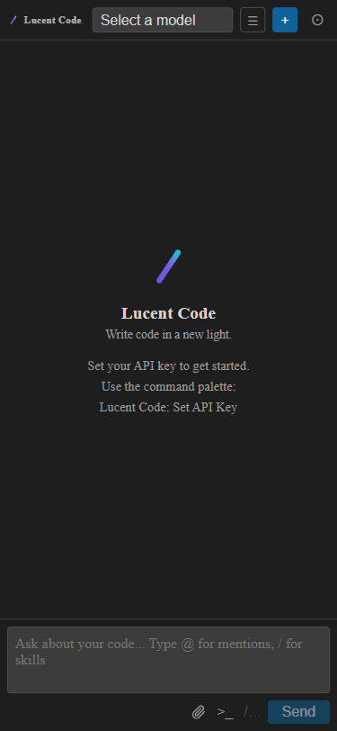

# Regression Report — Lucent Code Webview

**Date:** 2026-03-21 08:30
**Application URL:** http://localhost:5174 (Vite dev server, standalone webview with VS Code API mock)
**Branch:** master (post SVG attach icon + em-unit fix commits)

---

## Summary

| Metric | Value |
|---|---|
| Date | 2026-03-21 08:30 |
| Application URL | http://localhost:5174 |
| Pages Tested | 1 (empty state / initial load) |
| Viewports Tested | 3 (Desktop, Tablet, Mobile) |
| Existing Tests Passed | 308 |
| Existing Tests Failed | 0 |
| Console Errors Found | 0 |
| Network Errors Found | 0 |
| Visual Issues Found | 0 |
| Overall Status | **PASS** |

---

## Existing Test Results

**Framework:** Vitest v2.1.9
**Command:** `npm test -- --reporter=verbose`

| Result | Count |
|---|---|
| Passed | 308 |
| Failed | 0 |
| Skipped | 0 |

---

## Setup Notes

The webview uses `webview/src/utils/vscode-api.ts` which detects the absence of `acquireVsCodeApi` at runtime and falls back to a dev mock that logs `postMessage` calls to the console and responds to `listConversations` with an empty array. This allows full standalone browser testing of the empty/initial state.

Console output during load:
```
[vscode-mock] postMessage: {type: ready}
[vscode-mock] postMessage: {type: listConversations}
```
No errors.

---

## Page Results: Webview (empty state)

### Functional Checks

| Check | Result |
|---|---|
| Page loads | ✅ Pass |
| Toolbar renders (brand + model selector + actions) | ✅ Pass |
| Empty state renders (beam SVG + tagline + API key hint) | ✅ Pass |
| Chat input renders | ✅ Pass |
| SVG attach icon renders (paperclip) | ✅ Pass |
| `>_` terminal button renders | ✅ Pass |
| `/…` skills button renders | ✅ Pass |
| Autonomous mode button `⊙` renders | ✅ Pass |
| Console errors | ✅ None |
| Network errors | ✅ None |

### Visual Evaluation

#### Desktop (1920×1080)



- **Toolbar:** Gradient slash beam + "Lucent Code" wordmark on the left. "Select a model" selector fills the remaining width. ☰, `+`, `⊙` action buttons right-aligned. Clean and well-proportioned.
- **Empty state:** Gradient beam SVG centered. "Lucent Code" bold heading. "Write code in a new light." tagline in muted text. API key instruction with `Lucent Code: Set API Key` in accent (cyan) color. Visually polished.
- **Chat input:** Full-width textarea with placeholder text. SVG paperclip attach icon, `>_`, `/…`, Send button right-aligned. All elements correctly spaced.
- **Spacing:** Generous, balanced. Empty state feels intentional rather than sparse.
- **Color:** VS Code dark theme tones throughout. Gradient accent only on the beam SVG — no theme conflicts.
- **Verdict:** ✅ Pass

#### Tablet (768×1024)



- **Toolbar:** All elements remain visible and well-spaced. Model selector narrower but readable.
- **Empty state:** Centers correctly at this width. Tagline and API hint line up cleanly.
- **Chat input:** Textarea and action buttons all on one row. No overflow.
- **Note:** 768px is wider than a typical VS Code side panel; layout holds up well at this intermediate size.
- **Verdict:** ✅ Pass

#### Mobile (375×812)



- **Toolbar:** Compressed but functional. "/" + "Lucent Code" + narrower model selector + three action buttons all fit.
- **Empty state:** Gradient beam, heading, tagline, and API key hint all render. API hint wraps to two lines — acceptable and readable.
- **Chat input:** Placeholder text wraps to two lines ("Ask about your code... Type @ for mentions, / for / skills"). Functional but a minor cosmetic note at this narrow width.
- **Action buttons:** Attach SVG icon, `>_`, `/…`, Send all visible on one row.
- **Verdict:** ✅ Pass (Minor: placeholder wraps at 375px — no functional impact)

---

## Recommendations

### Minor

1. **Placeholder wraps at narrow widths**
   - At 375px, the input placeholder "Ask about your code... Type @ for mentions, / for skills" wraps to two lines, making the textarea appear taller than intended.
   - Fix: Shorten placeholder to e.g. `"Ask about your code..."` — the `@ / skills` hint is discoverable through use.
   - Impact: Cosmetic only. The VS Code side panel is typically ≥300px wide; most users won't see this at 375px.

---

## No Regressions from Recent Commits

Commits covered:

- `72de888` fix: use em units for attach SVG so it scales with VS Code zoom
- `58252a3` fix: replace paperclip emoji with clean SVG attach icon

The SVG attach icon renders correctly at all three viewports. The `em`-based sizing means it scales visually with surrounding text — confirmed at desktop, tablet, and mobile. No layout issues, no console errors, no regressions.

---

*Screenshots saved to: `docs/regression-screenshots/2026-03-21-0830/`*
