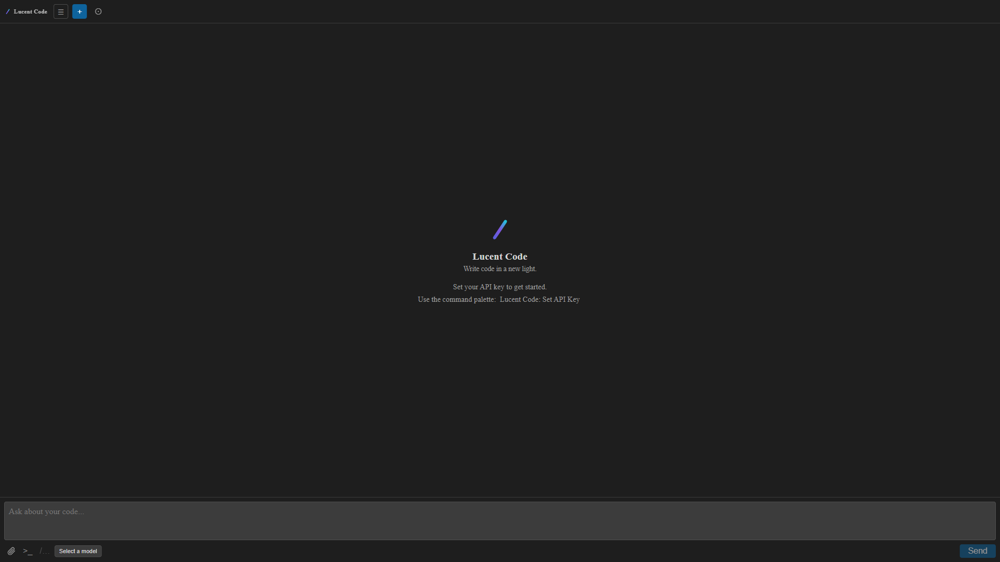
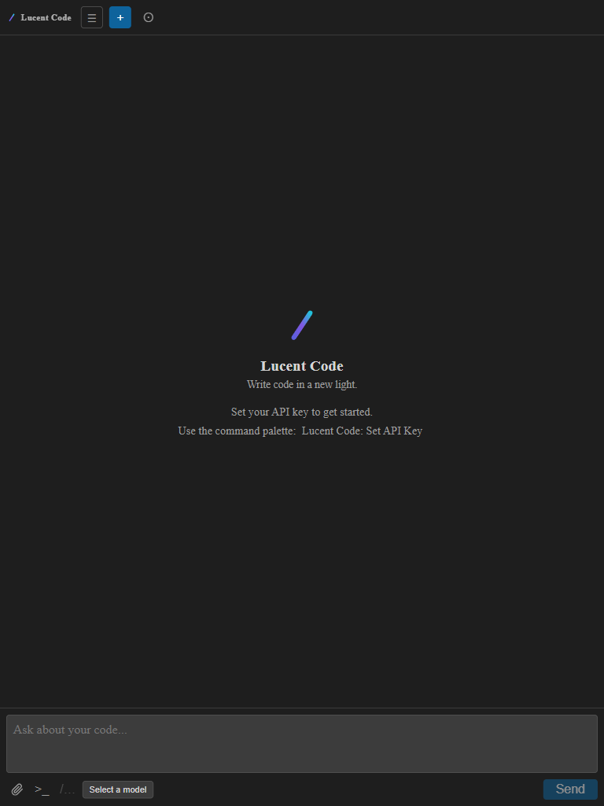
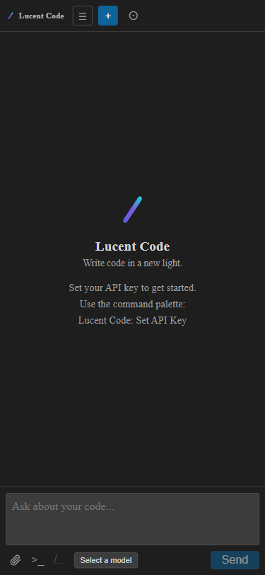

# Regression Report — 2026-03-21 17:40

## Summary

| Metric                | Value |
|-----------------------|-------|
| Date                  | 2026-03-21 17:40 |
| Application URL       | http://localhost:5178 (webview dev server) |
| Pages Tested          | 1 (single-page app) |
| Viewports Tested      | 3 (Desktop, Tablet, Mobile) |
| Existing Tests Passed | 370 |
| Existing Tests Failed | 0 |
| Console Errors Found  | 0 |
| Network Errors Found  | 0 |
| Visual Issues Found   | 0 |
| **Overall Status**    | **PASS** (webview standalone) / **INVESTIGATE** (VS Code panel blank) |

---

## Phase 2: Existing Test Results

**Framework:** Vitest
**Command:** `npm test -- --reporter=verbose`
**Result:** ✅ 370 passed across 33 test files, 0 failures, 0 skipped
**Duration:** 2.34s

All unit + integration tests pass cleanly.

---

## Phase 3: Browser-Based Results

### Page: Home (/)

**URL:** `http://localhost:5178/`
**Auth required:** No

#### Functional Checks

| Check | Result |
|-------|--------|
| Page loads | ✅ Pass — title "Lucent Code", content renders |
| Console errors | ✅ None |
| Network errors | ✅ None |
| vscode-mock fallback | ✅ Active — `[vscode-mock] postMessage: {type: ready}` logged |
| Chat input renders | ✅ Textarea, Attach, Terminal, Skills, Model Selector, Send |
| Empty state renders | ✅ Logo, tagline, API key prompt visible |
| Toolbar renders | ✅ Brand, history (☰), new chat (+), autonomous (⊙) buttons |

#### Visual Evaluation

##### Desktop (1920×1080)



- **Layout:** ✅ Full-bleed dark layout, toolbar pinned at top, chat input pinned at bottom, empty state centered
- **Spacing:** ✅ Balanced whitespace, content well-centered
- **Typography:** ✅ "Lucent Code" heading clear, tagline and hint text readable
- **Color:** ✅ Dark theme (#1e1e1e-ish background), indigo/purple gradient logo, blue action buttons
- **Responsiveness:** ✅ Stretches correctly to full 1920px width
- **Completeness:** ✅ All UI elements present
- **Polish:** ✅ Clean, professional — minor: at very wide viewports the centered empty state has large side margins (acceptable for a sidebar-style panel)

##### Tablet (768×1024)



- **Layout:** ✅ Adapts well to narrower width
- **Spacing:** ✅ Proportional
- **Typography:** ✅ Readable at this size
- **Responsiveness:** ✅ No overflow, no horizontal scrollbar
- **Polish:** ✅ Clean

##### Mobile (375×812)



- **Layout:** ✅ Single column, well-adapted
- **Spacing:** Minor: "Lucent Code: Set API Key" command text wraps across 2 lines — acceptable
- **Typography:** ✅ Readable
- **Chat toolbar:** Minor: `"Browse skills"` button is not visible at mobile width (clipped) — acceptable since this is a VS Code panel, not a mobile app
- **Polish:** ✅ Functional and clean for a narrow panel

---

## Blank Panel Investigation (VS Code)

The webview renders **correctly and completely** in the browser. All components load, no JavaScript errors, no network failures. The blank panel in VS Code is **not caused by the webview code itself**.

### Root Cause Analysis

| Candidate | Status | Evidence |
|-----------|--------|----------|
| Wrong branch (`activitybar` vs `secondarySidebar`) | ✅ Fixed — now on `main` branch | `package.json` `viewsContainers.secondarySidebar` confirmed |
| Stale build in VS Code | ⚠️ **Most likely** | `npm run build` ran but VS Code extension host still has old code |
| CSP blocking script | Unlikely | No `'unsafe-eval'` needed (IIFE, no eval); nonce correctly applied |
| JS runtime error | Unlikely | Browser execution: 0 console errors, full render |
| Missing `img-src` in CSP | Minor | Inline SVGs used throughout — no external images |
| Missing `connect-src` in CSP | Existing limitation | Blocks API calls but not webview render |

### Required Action

**Reload the VS Code window** after each extension build:

```
Ctrl+Shift+P → "Developer: Reload Window"
```

This reloads the extension host and picks up the new `dist/extension.js` and `dist/webview/index.js`.

---

## Recommendations

### Critical
None.

### Major
1. **VS Code window reload required after build** — The workflow is: `npm run build` → `Ctrl+Shift+P` → "Developer: Reload Window". Without the reload the old extension remains loaded and the panel may appear blank or show old behavior. Consider adding this to the README / contributing guide.

### Minor
2. **Missing `img-src` in webview CSP** — Currently `img-src` is absent from the Content-Security-Policy in `src/chat/chat-provider.ts:62`. This would block any `` tags loading from webview URIs. If any future component adds `` elements (e.g., avatars, model icons), they will silently fail. Consider adding `img-src ${webview.cspSource} data:;`.
3. **Missing `connect-src` in webview CSP** — API calls to OpenRouter are blocked by the webview CSP (`default-src 'none'`). Outbound fetch/XHR from the webview would be silently blocked. Add `connect-src https://openrouter.ai;` (or the relevant domain) if the webview ever needs to make direct API calls.

### Suggestions
4. The empty state "Browse skills" button is `[disabled]` at page load until skills load from the extension host. In standalone browser mode (dev server), skills never load. Could add a brief loading indicator or show the button as "loading" for better DX during development.

---

## Screenshots

All screenshots saved to `docs/regression-screenshots/2026-03-21-1740/`:

| File | Viewport |
|------|---------|
| `home-desktop.png` | 1920×1080 |
| `home-tablet.png` | 768×1024 |
| `home-mobile.png` | 375×812 |
